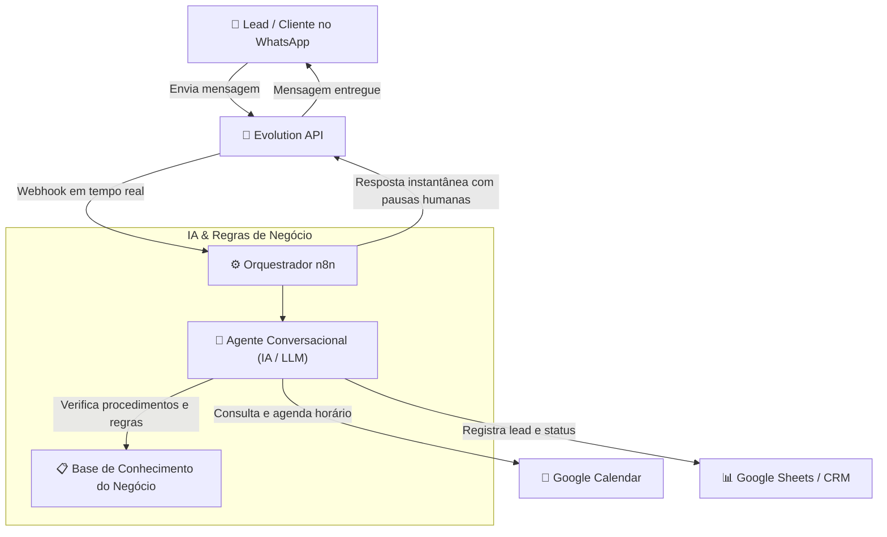

# 🤖 Agente de IA para WhatsApp & Sincronização Google Agenda (n8n)
> **Solução completa de atendimento conversacional 24/7, qualificação de leads, agendamento em tempo real e esteira de disparo seguro anti-ban.**  
> *Desenvolvido por **Bacci Dev** (Iago Bacci)*

---


---

## 🎯 Sobre o Projeto

Este projeto é uma solução de **automação conversacional de alto nível** para negócios que precisam atender clientes sem demora, tirar dúvidas frequentes e agendar consultas/reuniões automaticamente no calendário, sem choque de horário e sem exigir intervenção manual humana.

Embora o case demonstrativo inicial tenha sido modelado para clínicas odontológicas e de saúde, o fluxo foi construído de forma **100% modular e adaptável** para:
- Clínicas médicas, odontológicas e estéticas
- Escritórios de advocacia e consultorias
- Imobiliárias e corretores
- Prestadores de serviços e empresas B2B

---

## ⚡ Arquitetura da Solução



---

## 🚀 Principais Funcionalidades

1. **Atendimento 24/7 em Linguagem Natural:** Responde de forma humanizada, empática e contextualizada, eliminando respostas robóticas engessadas.
2. **Sincronização Direta com Google Agenda:** Consulta datas/horários vagos em tempo real e bloqueia o evento assim que o cliente confirma, sem risco de conflito.
3. **Esteira de Disparo Anti-Ban com Google Sheets:** Agendamento cronometrado em horário comercial (Seg-Sex 09:30), pausas randômicas e limites diários seguros.
4. **Higienização Inteligente de Nomes (Python):** Script que remove lixo cadastral (ex: `CRO-SP`, sufixos de cidade, especialidades em caixa alta) e formata a saudação ideal (`Dr.`, `Dra.`, primeiro nome).
5. **Tratamento de Exceções & Fail-Safe:** Nós configurados com `Continue on Fail` para que uma falha de conexão ou número inválido nunca interrompa o lote de automação.

---

## 📁 Estrutura do Repositório

```text
├── workflows/
│   ├── workflow_disparador_google_sheets_n8n.json  # Workflow de disparo seguro via planilha
│   └── workflow_disparador_whatsapp_n8n.json       # Workflow modular da Evolution API
├── scripts/
│   ├── extrator_whatsapp.py                        # Coletor e formatador multithread de dados
│   ├── higienizar_nomes_whatsapp.py                # Limpeza e padronização de nomes
│   └── requirements.txt                            # Dependências Python
├── exemplos/
│   └── modelo_planilha_contatos.csv                # Modelo fictício seguro para testes
├── docs/
│   └── midia_kit_bacci_dev.md                      # Mídia Kit comercial da solução
├── .env.example                                    # Modelo de variáveis de ambiente
├── .gitignore                                      # Proteção de dados sensíveis e LGPD
└── README.md                                       # Documentação completa
```

---

## 🛠️ Como Instalar e Rodar

### 1. Clonar o Repositório
```bash
git clone https://github.com/iagobacci/agente-ia-whatsapp-n8n.git
cd agente-ia-whatsapp-n8n
```

### 2. Configurar os Scripts Python
```bash
cd scripts
python -m venv venv
# No Windows:
.\venv\Scripts\activate
# No Linux/Mac:
source venv/bin/activate

pip install -r requirements.txt
```

Para testar o higienizador de nomes:
```bash
python higienizar_nomes_whatsapp.py
```

### 3. Importar os Workflows no n8n
1. Abra o seu painel do **n8n**.
2. Clique em **Workflows ➔ Import from File**.
3. Selecione o arquivo em `workflows/workflow_disparador_google_sheets_n8n.json`.
4. Conecte suas credenciais do **Google Sheets** e as credenciais da **Evolution API**.
5. Ative o nó de agendamento cron para rodar no fuso horário `America/Sao_Paulo`.

---

## 🛡️ Segurança e Proteção LGPD

- Este repositório **não contém credenciais reais, chaves de API nem listas de contatos de clientes**.
- Arquivos de mídia grandes (`.mov`, `.mp4`) e bancos de dados reais são mantidos fora do controle de versão pelo `.gitignore`.
- Ao utilizar em produção, garanta que suas variáveis sejam carregadas exclusivamente via `.env` ou pelo cofre de credenciais nativo do n8n.

---

## 👨‍💻 Autor & Contato

**Iago Bacci** (Bacci Dev)  
*Especialista em Desenvolvimento Web, Inteligência Artificial e Automação de Processos.*

- **Instagram:** [@baccidev](https://instagram.com/baccidev)
- **WhatsApp:** [Fale comigo no WhatsApp](https://wa.me/5511917163127)
- **GitHub:** [github.com/iagobacci](https://github.com/iagobacci)

---

## 📄 Licença

Este projeto está sob a licença [MIT](LICENSE). Sinta-se livre para usar, adaptar e estender para seus projetos comerciais e clientes.
