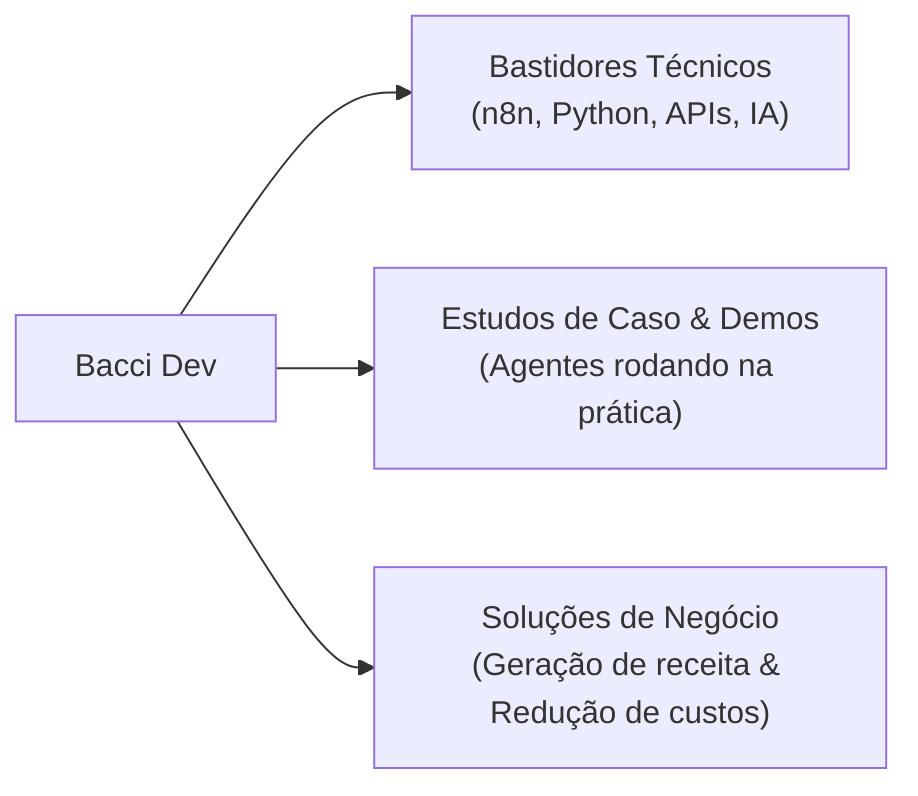

# Mídia Kit Oficial • Bacci Dev
> **Inteligência Artificial, Automação de Processos e Soluções Digitais de Alta Conversão**

---

## 1. Quem é Bacci Dev?

**Bacci Dev** é a marca pessoal e estúdio de soluções tecnológicas liderado por **Iago Bacci**, desenvolvedor focado na criação de automações, integração de APIs e agentes de atendimento para negócios.

O foco central é simples e direto: **eliminar tarefas operacionais repetitivas, acelerar o tempo de resposta comercial a zero e transformar processos manuais em máquinas digitais de faturamento.**

> [!NOTE]
> **Missão:** Conectar tecnologia de ponta (LLMs, automação low-code e integrações via API) à realidade prática de pequenas e médias empresas, clínicas e prestadores de serviços, gerando ROI rápido e mensurável.

---

## 2. Pilares de Posicionamento & Conteúdo (@baccidev)

No ecossistema do Instagram, o perfil **Bacci Dev** atua na interseção entre **Tecnologia Aplicada**, **Demonstrações Práticas ("Show, Don't Tell")** e **Negócios/Vendas**:



### Temas Centrais Abordados:
- **Demonstrações Visuais:** Vídeos práticos de telas divididas (WhatsApp + CRM/Agenda) mostrando a IA interagindo como humano.
- **Automação de Vendas & Atendimento:** Redução drástica de tempo de resposta (*Speed-to-Lead*), triagem e qualificação automática de clientes.
- **Engenharia de Dados & Prospecção:** Mineração de dados B2B (scraping), higienização de listas e esteiras de disparo seguro.
- **Dicas e Visão de Mercado:** Como donos de empresas e gestores de tráfego podem usar IA para escalar suas operações sem aumentar a folha de pagamento.

---

## 3. Portfólio de Soluções & Serviços Oferecidos

| Solução | O que entrega | Impacto Direto para o Cliente |
| :--- | :--- | :--- |
| **🤖 Agentes de IA para WhatsApp** | Atendimento conversacional 24/7 com contexto do negócio, qualificação de leads e integração nativa com Google Calendar ou CRM. | Atendimento instantâneo a qualquer hora (inclusive noites e fins de semana), zero perda de leads e agenda sempre cheia. |
| **🔄 Máquina de Reativação de Clientes** | Higienização da base inativa da empresa e disparos humanizados com IA para resgatar vendas de clientes antigos. | Geração de caixa rápido sem gastar nada com anúncios pagos. |
| **🌐 Landing Page + Automação (Máquina de Vendas)** | Páginas modernas de altíssima velocidade integradas a webhooks que acionam o WhatsApp do lead e do vendedor em menos de 10s. | Multiplica a taxa de conversão do tráfego e impede que o visitante esfrie. |
| **📊 Mineração & Enriquecimento de Dados B2B** | Extração de contatos qualificados e validados (WhatsApp, Instagram, sócios) segmentados por nicho e região. | Alimenta times comerciais e de SDRs com leads quentes e prontos para abordagem. |
| **📑 Automação de Documentos & Backoffice (OCR + IA)** | Leitura inteligente de notas fiscais, boletos, contratos e comprovantes, enviando dados estruturados para planilhas ou ERPs. | Economiza centenas de horas do time administrativo/financeiro e elimina erros de digitação. |

---

## 4. Perfil de Público & Clientes Atendidos

### Demografia e Setores:
- **Empresários e Donos de Negócios Locais:** Clínicas médicas, odontológicas e de estética; escritórios de advocacia e contabilidade; imobiliárias e corretores.
- **Gestores de Tráfego e Agências de Marketing:** Profissionais que geram leads para clientes e precisam garantir que esses leads sejam atendidos na hora para evitar cancelamento de contratos.
- **Equipes Comerciais B2B:** Startups, distribuidores e prestadores de serviços corporativos em busca de inteligência de dados e prospecção ativa.

---

## 5. Modelos de Parceria & Contratação

```
┌─────────────────────────────────────────────────────────────┐
│                   FORMATOS DE ATUAÇÃO                       │
├──────────────────────────────┬──────────────────────────────┤
│ 1. Projetos Sob Medida       │ 2. Parceria com Agências     │
│    • Setup de Implantação    │    • Atendimento White Label │
│    • Mensalidade de Suporte  │    • Divisão de Comissão     │
│    • Treinamento e Entrega   │    • Co-produção de Ofertas  │
├──────────────────────────────┼──────────────────────────────┤
│ 3. Consultoria & Diagnóstico │ 4. Campanhas no Êxito (ROI)  │
│    • Mapeamento de gargalos  │    • Setup de infraestrutura │
│    • Desenho de arquitetura  │    • % sobre vendas geradas  │
└──────────────────────────────┴──────────────────────────────┘
```

### 1. Clientes Finais (Direto com a Empresa):
- **Setup Único:** Desenvolvimento, personalização de prompts, treinamento de base e integração de APIs.
- **Mensalidade / Retainer:** Manutenção de servidores (VPS/n8n/Docker), evolução de fluxos, monitoramento contínuo e suporte técnico.

### 2. Parcerias Estratégicas com Agências e Gestores de Tráfego:
- **Modelo de Co-parceria:** A agência oferece o agente de IA como diferencial competitivo para os clientes de tráfego, garantindo conversão máxima dos anúncios.
- **Comissionamento por Indicação:** Bonificação contínua ou divisão do setup por cliente indicado.

---

## 6. Diferenciais Competitivos da Bacci Dev

1. **Abordagem Hands-on com Código Real:** Não ficamos limitados a ferramentas prontas com respostas robóticas. Desenvolvemos com Python, APIs modernas e n8n, garantindo flexibilidade total.
2. **Foco Obsessivo em Humanização:** Diálogos naturais, com pausas realistas, tratamento de áudio, validação de horários reais e empatia na conversa.
3. **Agilidade de Implantação:** MVPs e pilotos operacionais entregues em tempo recorde (de 3 a 7 dias úteis).
4. **Infraestrutura Robusta e Segura:** Automações rodando em instâncias dedicadas, com contingência contra quedas e regras rígidas de segurança contra bloqueios no WhatsApp.

---

## 7. Contato & Canais Oficiais

- **Instagram:** [@baccidev](https://instagram.com/baccidev)
- **E-mail Comercial:** contato@baccidev.com *(ou seu e-mail preferido)*
- **WhatsApp Oficial:** Direct no Instagram ou link na Bio
- **Portfólio / Demonstrações:** Vídeos práticos e cases disponíveis no feed e nos destaques do perfil.
